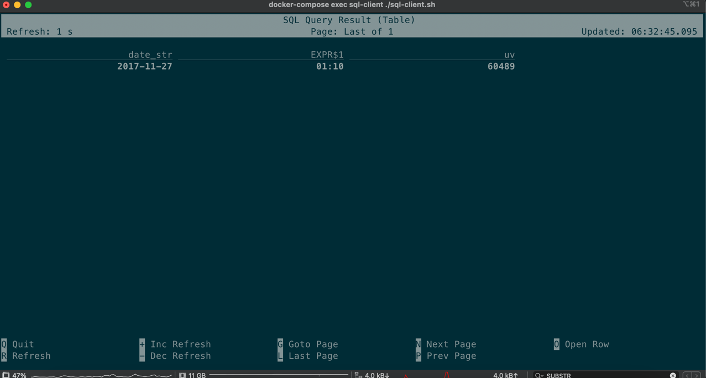

# 1. 启动docker

## 1.1 修改datagen写入kafka的速度

```yml
  datagen:
    command: "省略前面的命令 --speedup 改这里默认3000"
```

## 1.2 docker compose启动

```bash
docker compose up -d
```

## 1.3 检查下kafka的数据

消费10条记录看下

```bash
docker-compose exec kafka bash -c 'kafka-console-consumer.sh --topic user_behavior --bootstrap-server kafka:9094 --from-beginning --max-messages 10'
```

```json
{
  "user_id": "952483",
  "item_id": "310884",
  "category_id": "4580532",
  "behavior": "pv",
  "ts": "2017-11-27T00:00:00Z"
}
```


## 1.4 检查kibana启动情况

打开[http://localhost:5601/](Kibana)看下kibana的界面


## 1.5 看下Flink的启动情况

打开[http://localhost:8081/#/overview](Flink UI)看下Flink  


## 1.5 进入sql cli

```bash
docker-compose exec sql-client ./sql-client.sh
```

# 2. 执行查询

## 2.1 Kafka source表

定义用户行为表从Kafka消费数据:

```sql
CREATE TABLE user_behavior
(
    user_id     BIGINT,
    item_id     BIGINT,
    category_id BIGINT,
    behavior STRING,
    ts          TIMESTAMP(3),
    proctime    AS PROCTIME(),                   -- generates processing-time attribute using computed column
    WATERMARK FOR ts AS ts - INTERVAL '5' SECOND -- defines watermark on ts column, marks ts as event-time attribute
)
WITH (
    'connector' = 'kafka', -- using kafka connector
    'topic' = 'user_behavior', -- kafka topic
    'scan.startup.mode' = 'earliest-offset', -- reading from the beginning
    'properties.bootstrap.servers' = 'kafka:9094', -- kafka broker address
    'format' = 'json' -- the data format is json
);
```

`'format' = 'json'`使用json来进行格式转换，`proctime    AS PROCTIME()`，
定义了一个列来返回当前时间戳，`WATERMARK FOR ts AS ts - INTERVAL '5' SECOND`使用消息中的ts字段当做事件时间并且水位线允许有5秒的延迟(乱序)

运行下:

```sql
SELECT *
FROM user_behavior;
```

截图:  


## 2.2 统计每小时的成交量

### 2.2.1 ES结果表

主要保存2个数据，一个是当天的第几个小时另一个是这小时的成交总数 这个数据需要写入ES，所以定义一个写入ES的结果表:

```sql
CREATE TABLE buy_cnt_per_hour
(
    hour_of_day BIGINT,
    buy_cnt     BIGINT
)
WITH (
    'connector' = 'elasticsearch-7', -- using elasticsearch connector
    'hosts' = 'http://elasticsearch:9200', -- elasticsearch address
    'index' = 'buy_cnt_per_hour' -- elasticsearch index name, similar to database table name
);
```

ES索引`buy_cnt_per_hour`会在第一条数据写入时自动创建。

### 2.1.2 进行统计

**统计每小时的成交量**:
每小时: 窗口大小为1小时的滚动窗口  
成交量: user_behavior表中`behavior`为buy的事件都是进行购买的，对此进行COUNT(*)
显示小时: 使用HOUR(timestamp)函数来获取当天第几个小时(窗口函数是会返回window_start和window_end的)  


sql如下:

```sql
INSERT INTO buy_cnt_per_hour
SELECT HOUR(window_start) as hour_of_day, COUNT(*) as buy_cnt
FROM TABLE(TUMBLE(TABLE user_behavior, DESCRIPTOR(ts), INTERVAL '1' HOUR))
GROUP BY window_start, window_end;
```

### 2.2.3 Kibana统计

新建一个index pattern


看下索引的数据,已经有了几条


绘图


就是这个样子，凌晨的成交量是低的

## 2.3 统计一天每10分钟累计独立用户数

统计一天中每一刻的累计独立用户数（uv），也就是每一刻的 uv 数都代表从0点到当前时刻为止的总计 uv 数，是单调递增的。

### 2.3.1 ES结果表

这次要存储一个uv数，以及日期和时间(分开)，同时将日期和时间作为ES的主键来进行更新

```sql
CREATE TABLE cumulative_uv
(
    date_str STRING,
    time_str STRING,
    uv BIGINT,
    PRIMARY KEY (date_str, time_str) NOT ENFORCED
)
WITH (
    'connector' = 'elasticsearch-7',
    'hosts' = 'http://elasticsearch:9200',
    'index' = 'cumulative_uv'
);
```

### 2.3.2 进行统计

看着比较邪门的写法。。。:
首先用`DATE_FORMAT`把时间转换成yyyy-MM-dd的格式作为日期，  
HH:mm作为小时和分钟，但是是每10分钟的，所以进行了一些修整取出HH:m然后字符串拼接上一个0，这样都会修成小时:某10分钟的格式了

```sql
INSERT INTO cumulative_uv
SELECT date_str, MAX(time_str), COUNT(DISTINCT user_id) as uv
FROM (
         SELECT DATE_FORMAT(ts, 'yyyy-MM-dd')                 as date_str,
                SUBSTR(DATE_FORMAT(ts, 'HH:mm'), 1, 4) || '0' as time_str,
                user_id
         FROM user_behavior)
GROUP BY date_str;
```

如果单独执行这条语句，只会输出一条结果(因为只有1天的数据吗group by后就是一条了)  
但是Kafka的消息是一点一点写入的，所以会看到`MAX(time_str), COUNT(DISTINCT user_id) as uv`不断变化的样子  
而ES的主键是日期和时间所以会不断的得加(更新)

```sql
SELECT date_str, MAX(time_str), COUNT(DISTINCT user_id) as uv
FROM (
         SELECT DATE_FORMAT(ts, 'yyyy-MM-dd')                 as date_str,
                SUBSTR(DATE_FORMAT(ts, 'HH:mm'), 1, 4) || '0' as time_str,
                user_id
         FROM user_behavior)
GROUP BY date_str;
```




### 2.3.3 绘图

效果是这样的


## 2.4 顶级类目排行榜

消息中的类目是子类目很多而且杂，统计交易的父类目(大类目)的数量更有统计意义。

### 2.4.1 Mysql维表

因为大类目的信息需要Mysql来进行补充所以定义下Mysql的纬度表:

```sql
CREATE TABLE category_dim
(
    sub_category_id BIGINT,
    parent_category_name STRING
)
WITH (
    'connector' = 'jdbc',
    'url' = 'jdbc:mysql://mysql:3306/flink',
    'table-name' = 'category',
    'username' = 'root',
    'password' = '123456',
    'lookup.cache.max-rows' = '5000',
    'lookup.cache.ttl' = '10min'
);
```

`lookup.cache.max-rows`和`lookup.cache.ttl`分别代表缓存的行数和时间  
查看下数据的格式:

```sql
select *
from category_dim
LIMIT 10;
```


### 2.4.3 ES结果表

只要存储一个类目的总数和一个类目的名称就足够了

```sql
CREATE TABLE top_category
(
    category_name STRING PRIMARY KEY NOT ENFORCED,
    buy_cnt BIGINT
)
WITH (
    'connector' = 'elasticsearch-7',
    'hosts' = 'http://elasticsearch:9200',
    'index' = 'top_category'
);
```

`category_name`作为ES的主键

### 2.4.4 统计数据

Lookup JOIN需要一个处理时间,`FOR SYSTEM_TIME AS OF u.proctime`从Mysql中每次查出最新的数据进行关联

```sql
INSERT INTO top_category
SELECT ca.parent_category_name AS category_name, COUNT(*) as buy_cnt
FROM user_behavior as u
         JOIN category_dim FOR SYSTEM_TIME AS OF u.proctime as ca
ON u.category_id=ca.sub_category_id
WHERE u.behavior = 'buy'
GROUP BY ca.parent_category_name;
```

### 2.4.5 绘图

这样就能看出来哪个大类买的最多，每个大类各卖了多少
